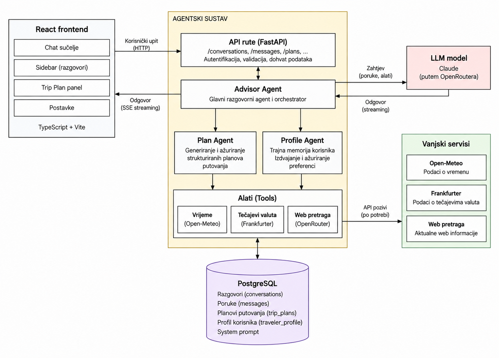

# AI Travel Advisor

A full-stack AI travel advisor that helps users plan trips, research current travel information, and maintain persistent traveler preferences across conversations.

## Features
- AI travel advisor with a multi-agent architecture
- Structured and editable trip plans
- Persistent conversations
- Traveler preferences reused across conversations
- Live weather and exchange-rate data
- Current travel information through web search
- Streaming AI responses
- Editable advisor system prompt
- Automatic conversation titles
- Conversation pinning
- Tool progress indicators during live-data requests
- Setup & run
- Prerequisites
- Docker Desktop with Docker Compose
- an OpenRouter API key

## Run
1. Enter the project directory.
2. Create a `.env` file from `.env.example` and set `OPENROUTER_API_KEY` to a valid OpenRouter API key (https://openrouter.ai/workspaces/default/keys)
*  For free model usage, set:
    OPENROUTER_API_KEY=your_api_key_here
    ADVISOR_MODEL=openrouter/free

> **Note:** The project was originally developed and tested using a paid-capability OpenRouter model. For evaluation and demonstration purposes, the project is configured to use OpenRouter's free model routing (`openrouter/free`), which allows the application to be run without additional model costs. Free models are subject to OpenRouter's usage and availability limits.

3. Run:

```bash
docker compose up --build 
```

The application starts the frontend, FastAPI backend and PostgreSQL database through Docker Compose.

## Architecture

The application is built as a single FastAPI backend with a React frontend and PostgreSQL database.
The backend uses three specialized agents:



The Advisor Agent is responsible for the conversational experience and decides when external information or another specialized agent is needed.

The Plan Agent manages the structured trip plan. It is only invoked when the user explicitly asks to create or change an itinerary, so normal travel questions do not accidentally modify the plan.

The Profile Agent extracts durable traveler preferences from conversations and stores them separately from trip-specific information. The stored profile is added to the Advisor context when a new message is processed, which allows preferences to be reused across conversations.

External information is accessed through three tools: weather data from Open-Meteo, exchange rates from Frankfurter and current travel/web information through OpenRouter web search.

All agents run in the same FastAPI process. The system does not use separate microservices, queues, or background agent services.

## Tools

The Advisor can use three live-data tools:

- Weather: Open-Meteo
- Exchange rates: Frankfurter
- Current travel/web information: OpenRouter web search

All agents run in the same FastAPI process. The project does not use separate microservices, queues or background agent services.

## Key decisions

1. One backend with multiple agents

    The application uses multiple specialized agents for different responsibilities, but they all run inside the same FastAPI application. This keeps the project easy to run and understand while still giving each agent a clear responsibility.

2. Advisor Agent as the orchestrator

    The Advisor Agent is the main conversational agent and uses tools to decide when live information or a structured trip-plan update is needed. A separate orchestrator agent was intentionally avoided because it would add another model call and additional complexity without providing a useful separation of responsibility.

3. PostgreSQL

    Conversations, messages, trip plans, traveler preferences and the system prompt are persisted in PostgreSQL. This allows conversations and traveler preferences to survive restarts and makes cross-conversation memory explicit rather than relying on frontend or model state.

4. Deterministic memory retrieval

    Traveler memory is retrieved directly from PostgreSQL and provided to the Advisor Agent. The Profile Agent is responsible for extracting and updating durable preferences, while retrieval itself is deterministic. This avoids using an additional agent just to decide which stored memories to retrieve.

5. Structured trip plans

    Trip plans are stored as structured JSON data rather than only as assistant text. This makes them independently editable by the user and allows the frontend to render the itinerary as a dedicated object.

6. Editable system prompt

    The advisor system prompt is stored in the database and can be edited through the Settings page. The prompt is read when a message is processed, so changes take effect immediately without restarting the application.

7. Live information

    Separate tools are used for information that can change over time instead of relying on the model's knowledge. Weather uses Open-Meteo, exchange rates use Frankfurter and broader current travel information uses web search.

## AI usage

Claude Code was used throughout development for repository exploration, implementation, debugging, code review and testing.

Development followed an iterative workflow: major features were implemented and then tested before moving on to the next milestone. When issues were found during testing, Claude Code was used to investigate the cause, implement the fix and re-test the affected functionality.

Examples included debugging an unavailable OpenRouter model and fixing unexpected structured output from the trip-planning agent. The latter was found during live testing, which led to a simplified tool schema and additional validation.

## Known limitations
1. No authentication or authorization

    User accounts were left out because they are outside the scope of the project. A production version would need authentication and authorization.

2. Sensitive data handling

    The Profile Agent is instructed not to store sensitive information such as passport numbers, card details or passwords. This was also tested during development. However, this is not a complete privacy solution: sensitive information entered directly into a chat message could still be stored as part of the conversation history. A production version would need stronger data handling and privacy controls.

3. No rate limiting

    There is currently no rate limiting on the message endpoint. A production version would need protection against excessive usage and unexpected API costs.

4. No automated test suite

    The main features were tested manually, including chat, tools, trip plans, traveler memory and the main frontend flows. A full automated test suite would be useful for further development.

5. Weather forecast range

    The weather tool is limited to the forecast range provided by the external weather API, so dates outside that range cannot be answered with the same level of forecast accuracy.

## Beyond the core functionality

Several small UX improvements were added:

- Automatic conversation titles generated from the first user message
- Conversation pinning with a separate pinned section
- Empty-state landing screen with example prompts
- Tool progress indicators such as "Searching the web..." and "Checking the weather..."